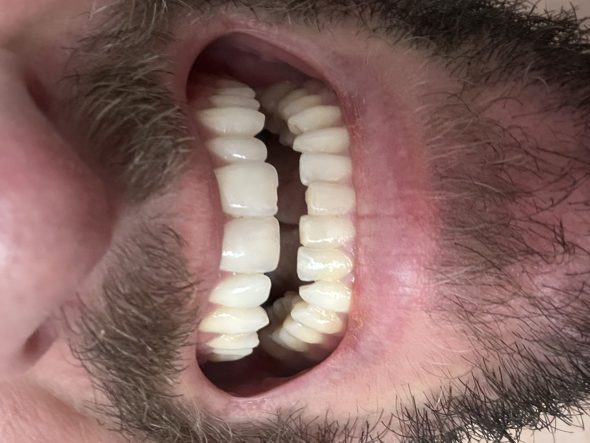

# OpenSource Ortho

[](https://github.com/john-lawniczak/OpenSourceOrtho/actions/workflows/ci.yml)

OpenSource Ortho is an open-source clear-aligner planning safety playground and research toolkit. It supports surface-based STL planning experiments today; reviewed CBCT/DICOM-derived anatomy is a higher-fidelity path for root/bone-aware checks, not a claim that the software produces a complete treatment plan.

[](docs/media/sample-demo.mp4)

> Upper and lower dental arches — the kind of intraoral input these planning
> experiments stage. ▶ [Watch the review-workspace demo (MP4)](docs/media/sample-demo.mp4):
> a stacked **Upper arch / Lower arch** 3D preview with loaded crown meshes,
> staged movement, findings, data gaps, and the local **Plan AI** helper.

## Mission

**Everyone deserves the right to their own data and access to a healthy, clean smile.**

Orthodontic planning is dominated by closed, expensive, proprietary systems that
lock patients out of their own scans and treatment data. OpenSource Ortho exists
to change that: a transparent, inspectable, community-owned toolkit where the
math is auditable, the data stays with the person it belongs to, and the safety
boundaries are explicit rather than hidden. The goal is a safety-boundary-first
planning playground for clear-aligner workflows: reproducible staged geometry,
data-gap visibility, and manufacturing-oriented exports that users evaluate and
use at their own responsibility and risk. The current build is not distributed as
a medical device, is not complete treatment-planning software, and does not
replace a licensed professional.

Most project documentation lives in [docs/](docs/README.md), including the
current [application maturity](docs/application%20maturity.md) scorecard.

New users can start with [HOW_TO.md](HOW_TO.md).

The first static UI prototype lives in [ui/](ui/README.md).

Scaffolding for the **lite** iOS and Android apps - thin native clients over the
same engine - lives in [mobile/](mobile/README.md).

The UI opens by default into a guided, step-by-step experience; the dense
technician workspace is one click away via the **Guided / Technician** toggle in
the left sidebar. A light/dark switch is anchored in the top bar.

- **Guided mode (default)**: a six-step wizard for non-technical users -
  **Upload → Teeth & time → Details → Review → 3D preview → Print / send**. It
  explains limits in plain language, lets you choose which teeth move and how
  long each tray is worn, animates the plan in 3D, surfaces a prominent
  **Ask AI about your plan** box, and exports printable files. It is designed to
  produce questions for a dental professional, not a do-it-yourself treatment plan.
- **Technician mode**: a professional planning workspace for staged movement, records,
  clinical controls, findings, mesh rendering, print metadata, and plan JSON.
- **Sample test case**: a fully isolated walkthrough that reuses the guided wizard
  (same step chips), pre-loaded with the two bundled test-case STL scans and a
  Balanced 10-day pace. It starts at step 1 so a first-time viewer can walk the
  whole flow, and it renders the real scans in 3D (the per-tooth movement layer is
  simulated over the whole-arch shell). It snapshots and restores your working
  state, so opening it never changes your own plan, uploads, or editors.
- **Print / send**: the final guided step builds printable 3D files (one model
  per stage plus a manifest) via `POST /api/print-package` and offers a zip
  download and a pre-filled email draft (`.eml`) you can open in your mail app to
  send the files to yourself or a print service.
- **Auto-segmentation (experimental)**: an on-device hybrid geometry segmenter
  proposes per-tooth meshes from a whole-arch scan via `POST /api/segment`.
  It uses arch position, height valleys, curvature, and face-normal changes to
  choose graph-cut-style boundaries, with optional Open3D mesh-processing support.
  It is a reviewable draft with per-tooth confidence - you correct the FDI numbers
  and **explicitly** apply it; nothing is auto-accepted, and scans never leave the
  machine. A `SegmentationModel` seam lets a local learned model (e.g. Teeth3DS)
  replace the geometric proposal later.
- **Generate Plan**: a one-click pipeline (the guided **Build my plan** button,
  and the Technician Review panel) that builds a
  cap-respecting staged plan from the best available target - your authored
  movement; per-tooth crown **landmarks** (real arch-form deviation targets plus a
  space analysis that budgets IPR, adds attachments, and checks crown collisions);
  segmented crown geometry; or, if only a raw scan is loaded, a clearly-labeled
  educational template. A deterministic orchestration step runs explicit named
  checks and a verdict (`CONSISTENT`/`ISSUES`, never "safe"/"approved"); an
  optional model review is consent-gated and linted. It is a proposal, not a
  diagnosis or treatment approval.
- **Safety-review tiers**: STL-only users get a first-class **Surface Review** based on
  visible crown geometry. CBCT/DICOM is not required for every user; it is the
  higher-fidelity path toward **Root/Bone-Aware Review** when the record is
  locally ingested, registered to the STL, segmented/reviewed, and validated. See
  [docs/cbct-evaluation.md](docs/cbct-evaluation.md).
- **Plan versions**: save named snapshots of a plan and restore any version back
  into the editor. Backed by a local case store (`.orthoplan-cases.json`,
  override with `ORTHOPLAN_CASE_STORE`); available in the UI Versions panel, the
  HTTP API (`/api/plan/version`, `/api/cases`), and the CLI (`case-save`,
  `case-list`, `case-versions`).
- **Plan AI chat**: a scoped advisory chat panel that can explain the current
  plan context, findings, data gaps, and timeline. The AI box shows a **single
  model dropdown** (each option carries its provider) and an **API-key field with
  plain-language instructions**, so it is obvious how to enable a real model; the
  key field is hidden for the **local helper**, which works without any key or
  external service. Live connectors for OpenAI (GPT), Claude (Anthropic), and any
  OpenAI-compatible host (MCP / open-source / self-hosted local models) are
  available and gated behind explicit per-session consent that data leaves the
  machine. The chat always sends the full plan context. The key is read only when
  you press **Ask AI** and is never persisted.

It is not an Invisalign clone, autonomous diagnostic system, clinical approval system, or complete treatment-planning system. The project focuses on geometric representation, configured-rule checks, staged tooth-movement proposals, visualization, printable package generation, and advisory evaluation under explicitly declared data limitations. Any physical use is the user's own responsibility and risk. The software and outputs are provided without warranty or liability for diagnosis, treatment, manufacturing, fit, materials, injury, regulatory compliance, or other use. The roadmap intentionally separates STL-only surface review from CBCT/DICOM-enhanced root/bone-aware review.

Visual progress representation is a first-class requirement. The UI must accurately show staged tooth movement, data gaps, units, and provenance without implying approval. See [docs/UI_DESIGN.md](docs/UI_DESIGN.md).

## Boundary

The software may:

- represent proposed tooth movements and staged aligner-style plans
- import, export, and visualize dental mesh data
- attach and visualize CBCT/DICOM records when that roadmap phase ships
- check internal consistency against user-configured movement caps
- surface observational findings, data gaps, and handoff questions
- rank missing data by deterministic acquisition impact
- run local or explicitly configured remote model providers for advisory review
- open an auditable, scoped AI chat session over selected plan context
- generate reproducible handoff reports tying inputs to engine version and findings

The software may not:

- diagnose disease or malocclusion
- decide whether treatment is safe, suitable, approved, or complete
- produce or claim to produce a complete treatment plan
- infer unseen anatomy such as roots, bone, periodontal status, or CBCT findings when those records or reviewed derived anatomy are unavailable
- invent unsupported thresholds
- replace user judgment, consent, responsibility, or regulatory obligations

See [docs/SAFETY.md](docs/SAFETY.md) before using or contributing.

## How It Works

The first workflow is simple:

1. Upload an STL intraoral scan.
2. Segment the arch into individual tooth meshes.
3. Create a staged `TreatmentPlan` with per-tooth movement deltas.
4. Check each stage against user-configured movement caps.
5. Render cumulative progress frames in the UI.
6. Export a reproducible handoff report that clearly separates rule checks, model advisories, data gaps, and provenance.

CBCT/DICOM support is tiered: local record metadata intake, on-device viewing
handoff, STL-to-CBCT registration records, reviewed anatomy representation,
root/bone-aware checks when trusted anatomy exists, and manufacturing manifests
that label the review tier, unresolved data gaps, and user responsibility for any
physical use. Automated raw-volume root/bone segmentation remains future work.

For a quick demo, open the app and click **Sample Test Case** in the left
sidebar. The sample reuses the guided wizard, pre-loaded with the two bundled
test-case STL scans (`ui/example-scans/canonical-orthocad-001/`), and starts at
step 1 so you can walk the whole flow. The 3D preview renders the real scans with
a simulated movement layer; drag the stage slider to watch the planned movement
across stages. The per-tooth movement over a whole-arch shell is schematic, not a
clinical prediction. Use the on-screen **＋ / ⌂ / −** controls (or scroll/drag) to
zoom and orbit, the **Tooth #** toggle to label teeth, and **Exit Sample Test
Case** to return - your own work is untouched.

In the guided **Review** step (or the Technician Review panel), use **Plan AI** to
ask educational questions about the active plan. The default local helper stays on
this machine and needs no key. To use an external model, pick it from the single
**model dropdown** (e.g. GPT-5.5, Claude Opus 4.8, or an open-source / self-hosted
endpoint) in the AI box and paste your API key in the field shown there; the model
endpoint and egress-consent options live under **Connector settings**. The key is
read only when you press **Ask AI**; it is never written to plans, case snapshots,
or `localStorage` and is never echoed back by the server. See
[docs/AI_CHAT_MCP.md](docs/AI_CHAT_MCP.md).

Read [docs/ARCHITECTURE.md](docs/ARCHITECTURE.md) for the plain-language system overview.

## Maintainability

The project should stay modular and composable as it grows. Follow [docs/MAINTAINABILITY.md](docs/MAINTAINABILITY.md) for file-size guardrails, directory ownership, review checklist, and the maintainability check script.

## Initial Build Order

1. Safety and scope docs.
2. Core data model: `TreatmentPlan`, `Stage`, `ToothDelta`, `DataAvailability`.
3. IO and synthetic meshes.
4. Setup and staging engine with configurable caps.
5. Deterministic evaluators.
6. Controlled finding vocabulary.
7. Model provider adapters: OpenAI first, Claude Code second.
8. Prompt boundary injection.
9. Scoped AI chat and MCP connector data model.
10. Visualization frame contract and UI prototype.
11. CLI glue.

## References

Commercial software such as BlueSkyPlan and ClinCheck may be studied as workflow references only. Do not fork, copy, reverse engineer, or import proprietary source, assets, terminology, or private workflows. See [docs/OPEN_SOURCE_REFERENCES.md](docs/OPEN_SOURCE_REFERENCES.md) and [docs/SOURCES_AND_RECOMMENDED_SOFTWARE.md](docs/SOURCES_AND_RECOMMENDED_SOFTWARE.md).

## Development

### Run Locally

Use Python 3.11 or 3.12 if possible. Some fresh Homebrew Python 3.14 builds can fail
inside `ensurepip`/`pyexpat` on macOS; if that happens, create the venv with a stable
Python executable such as `python3.11`.

```bash
python3.11 -m venv .venv
source .venv/bin/activate
pip install -e ".[dev]"
orthoplan serve
```

Then open:

```text
http://127.0.0.1:8000
```

If your shell has a working `python3` but not `python`, use:

```bash
python3 -m venv .venv
source .venv/bin/activate
pip install -e ".[dev]"
orthoplan serve --host 127.0.0.1 --port 8000
```

If venv creation fails partway through, remove the broken environment and recreate it:

```bash
rm -rf .venv
/Users/johnlaw/.local/bin/python3.11 -m venv .venv
source .venv/bin/activate
pip install -e ".[dev]"
orthoplan serve
```

Run tests:

```bash
pytest
cd ui
npm test
cd ..
python3 tools/check_maintainability.py
```

### Local Mesh Workspace

Plan JSON never stores mesh bytes. To render real per-tooth STL meshes locally,
register each STL in a local mesh workspace, then link the returned `id` in the
plan's `mesh_assets` and `tooth_meshes`.

```bash
orthoplan register-mesh path/to/tooth_11.stl --workspace .orthoplan-meshes
ORTHOPLAN_MESH_WORKSPACE=.orthoplan-meshes orthoplan serve
```

The dev server exposes registered meshes only by asset id at `/api/mesh/<mesh_asset_id>`.
The UI renders real linked STL meshes when available and falls back to schematic
proxy teeth when no registered mesh can be loaded.

## Contribute Your Data

The engine gets better when more real scans and results are tested against it.
You can contribute STL intraoral scans and the plans/results you produced from
them. Every contributed dataset is tracked by a stable, **non-identifying**
specimen id (`spec-<uuid>`) so data stays organized as the collection scales -
without ever storing patient identity.

Privacy is enforced in code, not just requested. The manifest model
(`orthoplan/model/dataset.py`) stores redacted metadata only (never mesh bytes),
reduces filenames to a basename, forbids unknown fields, and has **no** name,
date-of-birth, contact, or record-number fields by construction (locked by a
test). Register a contribution locally with:

```bash
orthoplan register-contribution upper.stl lower.stl \
  --arch maxillary --units mm --i-confirm-no-phi \
  --out datasets/<your-folder>/manifest.json
```

The `--i-confirm-no-phi` flag is required and asserts you have removed
patient-identifying information. The first tracked specimen is the bundled
example at `ui/example-scans/canonical-orthocad-001/manifest.json`. See
[docs/DATA_CONTRIBUTION.md](docs/DATA_CONTRIBUTION.md) for the full workflow and
manifest schema, and [docs/SAFETY.md](docs/SAFETY.md) before sharing anything.

New to dental terminology? The [Glossary](docs/GLOSSARY.md) explains key terms
(IPR, tip, torque, crowding, FDI numbering) and includes a tooth-numbering
diagram; it is also reachable in the app via the **Key Terms** sidebar button.

## Contributing

Contributions are welcome. See [CONTRIBUTING.md](CONTRIBUTING.md) for the branch
and pull-request conventions, the contribution-type tags, the safety rules that
are enforced by code and review, and how to run the same checks CI runs. Commit
history is the canonical record of changes (`git log`).
