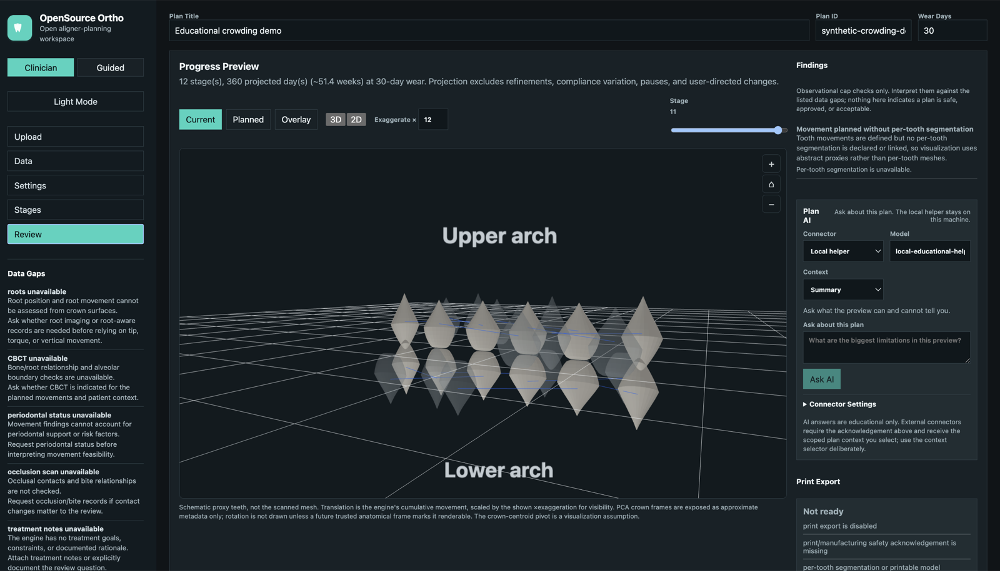

# OpenSource Ortho

[](https://github.com/john-lawniczak/OpenSourceOrtho/actions/workflows/ci.yml)

OpenSource Ortho is an open-source orthodontic treatment-planning research toolkit for clear-aligner workflows.

[](docs/media/sample-demo.mp4)

> The Review workspace: a stacked **Upper arch / Lower arch** 3D preview with
> loaded crown meshes, staged movement, findings, data gaps, and the local
> **Plan AI** helper. ▶ [Watch the demo (MP4)](docs/media/sample-demo.mp4).

## Mission

**Everyone deserves the right to their own data and access to a healthy, clean smile.**

Orthodontic planning is dominated by closed, expensive, proprietary systems that
lock patients out of their own scans and treatment data. OpenSource Ortho exists
to change that: a transparent, inspectable, community-owned toolkit where the
math is auditable, the data stays with the person it belongs to, and the safety
boundaries are explicit rather than hidden. It is not a medical device and does
not replace a licensed professional - it lowers the barrier to understanding and
participating in your own care.

Most project documentation lives in [docs/](docs/README.md).

New users can start with [HOW_TO.md](HOW_TO.md).

The first static UI prototype lives in [ui/](ui/README.md).

The UI includes two workflows:

- **Clinician mode**: a professional planning workspace for staged movement, records,
  clinical controls, findings, mesh rendering, print metadata, and plan JSON.
- **Guided Review mode**: an educational, non-diagnostic flow for people who have an STL or
  want to try a synthetic 12-month crowding demo. It is designed to explain limits,
  visualize movement, and produce questions for a dental professional, not to create
  a do-it-yourself treatment plan.
- **Generate Plan**: a one-click pipeline in the Review panel that builds a
  cap-respecting staged plan from the best available target - your authored
  movement; per-tooth crown **landmarks** (real arch-form deviation targets plus a
  space analysis that budgets IPR, adds attachments, and checks crown collisions);
  segmented crown geometry; or, if only a raw scan is loaded, a clearly-labeled
  educational template. A deterministic orchestration step runs explicit named
  checks and a verdict (`CONSISTENT`/`ISSUES`, never "safe"/"approved"); an
  optional model review is consent-gated and linted. It is a proposal, not a
  diagnosis or treatment approval.
- **Plan versions**: save named snapshots of a plan and restore any version back
  into the editor. Backed by a local case store (`.orthoplan-cases.json`,
  override with `ORTHOPLAN_CASE_STORE`); available in the UI Versions panel, the
  HTTP API (`/api/plan/version`, `/api/cases`), and the CLI (`case-save`,
  `case-list`, `case-versions`).
- **Plan AI chat**: a scoped advisory chat panel that can explain the current
  plan context, findings, data gaps, and timeline. The local helper works
  without external services. Live connectors for OpenAI, Claude Code, and any
  OpenAI-compatible host (MCP/Odysseus/open-source local models) are available
  and gated behind an explicit per-session consent that data leaves the machine.

It is not an Invisalign clone, medical device, diagnostic system, or treatment approval system. The project focuses on geometric representation, configured-rule checks, staged tooth-movement proposals, visualization, printable package generation, and advisory evaluation under explicitly declared data limitations.

Visual progress representation is a first-class requirement. The UI must accurately show staged tooth movement, data gaps, units, and provenance without implying approval. See [docs/UI_DESIGN.md](docs/UI_DESIGN.md).

## Boundary

The software may:

- represent proposed tooth movements and staged aligner-style plans
- import, export, and visualize dental mesh data
- check internal consistency against user-configured movement caps
- surface observational findings, data gaps, and handoff questions
- rank missing data by deterministic acquisition impact
- run local or explicitly configured remote model providers for advisory review
- open an auditable, scoped AI chat session over selected plan context
- generate reproducible handoff reports tying inputs to engine version and findings

The software may not:

- diagnose disease or malocclusion
- decide whether treatment is safe, suitable, approved, or complete
- infer unseen anatomy such as roots, bone, periodontal status, or CBCT findings
- invent unsupported thresholds
- replace user judgment, consent, responsibility, or regulatory obligations

See [docs/SAFETY.md](docs/SAFETY.md) before using or contributing.

## How It Works

The first workflow is simple:

1. Upload an STL intraoral scan.
2. Segment the arch into individual tooth meshes.
3. Create a staged `TreatmentPlan` with per-tooth movement deltas.
4. Check each stage against user-configured movement caps.
5. Render cumulative progress frames in the UI.
6. Export a reproducible handoff report that clearly separates rule checks, model advisories, data gaps, and provenance.

For a quick demo, open the app, switch to **Guided**, and click **Try 12-Month Demo**.
The demo uses synthetic crowding offsets and staged movement over twelve 30-day stages.
The 3D view stacks a labeled **Upper arch** above a **Lower arch** and loads bundled
rounded crown meshes (served from `ui/demo-meshes/`, exercising the same per-tooth
mesh-loading path real scans use). These crowns are synthetic educational proxies
for visual clarity, not patient anatomy, and do not claim clinical feasibility. Use
the on-screen **＋ / ⌂ / −** controls (or scroll/drag) to zoom and orbit.

In **Review**, use **Plan AI** to ask educational questions about the active
plan. The default local helper stays on this machine. To use an external
connector (OpenAI, Claude Code, or an OpenAI-compatible endpoint), open
**Connector Settings**, enter a key/endpoint, and tick the acknowledgement that
scoped plan context will be sent off the machine. The key is read only when you
press **Ask AI**; it is never written to plans, case snapshots, or `localStorage`
and is never echoed back by the server. See [docs/AI_CHAT_MCP.md](docs/AI_CHAT_MCP.md).

Read [docs/ARCHITECTURE.md](docs/ARCHITECTURE.md) for the plain-language system overview.

## Maintainability

The project should stay modular and composable as it grows. Follow [docs/MAINTAINABILITY.md](docs/MAINTAINABILITY.md) for file-size guardrails, directory ownership, review checklist, and the maintainability check script.

## Initial Build Order

1. Safety and scope docs.
2. Core data model: `TreatmentPlan`, `Stage`, `ToothDelta`, `DataAvailability`.
3. IO and synthetic meshes.
4. Setup and staging engine with configurable caps.
5. Deterministic evaluators.
6. Controlled finding vocabulary.
7. Model provider adapters: OpenAI first, Claude Code second.
8. Prompt boundary injection.
9. Scoped AI chat and MCP connector data model.
10. Visualization frame contract and UI prototype.
11. CLI glue.

## References

Commercial software such as BlueSkyPlan and ClinCheck may be studied as workflow references only. Do not fork, copy, reverse engineer, or import proprietary source, assets, terminology, or private workflows. See [docs/OPEN_SOURCE_REFERENCES.md](docs/OPEN_SOURCE_REFERENCES.md) and [docs/SOURCES_AND_RECOMMENDED_SOFTWARE.md](docs/SOURCES_AND_RECOMMENDED_SOFTWARE.md).

## Development

### Run Locally

Use Python 3.11 or 3.12 if possible. Some fresh Homebrew Python 3.14 builds can fail
inside `ensurepip`/`pyexpat` on macOS; if that happens, create the venv with a stable
Python executable such as `python3.11`.

```bash
python3.11 -m venv .venv
source .venv/bin/activate
pip install -e ".[dev]"
orthoplan serve
```

Then open:

```text
http://127.0.0.1:8000
```

If your shell has a working `python3` but not `python`, use:

```bash
python3 -m venv .venv
source .venv/bin/activate
pip install -e ".[dev]"
orthoplan serve --host 127.0.0.1 --port 8000
```

If venv creation fails partway through, remove the broken environment and recreate it:

```bash
rm -rf .venv
/Users/johnlaw/.local/bin/python3.11 -m venv .venv
source .venv/bin/activate
pip install -e ".[dev]"
orthoplan serve
```

Run tests:

```bash
pytest
cd ui
npm test
cd ..
python3 tools/check_maintainability.py
```

### Local Mesh Workspace

Plan JSON never stores mesh bytes. To render real per-tooth STL meshes locally,
register each STL in a local mesh workspace, then link the returned `id` in the
plan's `mesh_assets` and `tooth_meshes`.

```bash
orthoplan register-mesh path/to/tooth_11.stl --workspace .orthoplan-meshes
ORTHOPLAN_MESH_WORKSPACE=.orthoplan-meshes orthoplan serve
```

The dev server exposes registered meshes only by asset id at `/api/mesh/<mesh_asset_id>`.
The UI renders real linked STL meshes when available and falls back to schematic
proxy teeth when no registered mesh can be loaded.

## Contribute Your Data

The engine gets better when more real scans and results are tested against it.
You can contribute STL intraoral scans and the plans/results you produced from
them. Every contributed dataset is tracked by a stable, **non-identifying**
specimen id (`spec-<uuid>`) so data stays organized as the collection scales -
without ever storing patient identity.

Privacy is enforced in code, not just requested. The manifest model
(`orthoplan/model/dataset.py`) stores redacted metadata only (never mesh bytes),
reduces filenames to a basename, forbids unknown fields, and has **no** name,
date-of-birth, contact, or record-number fields by construction (locked by a
test). Register a contribution locally with:

```bash
orthoplan register-contribution upper.stl lower.stl \
  --arch maxillary --units mm --i-confirm-no-phi \
  --out datasets/<your-folder>/manifest.json
```

The `--i-confirm-no-phi` flag is required and asserts you have removed
patient-identifying information. The first tracked specimen is the bundled
example at `ui/example-scans/canonical-orthocad-001/manifest.json`. See
[docs/DATA_CONTRIBUTION.md](docs/DATA_CONTRIBUTION.md) for the full workflow and
manifest schema, and [docs/SAFETY.md](docs/SAFETY.md) before sharing anything.

New to dental terminology? The [Glossary](docs/GLOSSARY.md) explains key terms
(IPR, tip, torque, crowding, FDI numbering) and includes a tooth-numbering
diagram; it is also reachable in the app via the **Key Terms** sidebar button.

## Contributing

Contributions are welcome. See [CONTRIBUTING.md](CONTRIBUTING.md) for the branch
and pull-request conventions, the contribution-type tags, the safety rules that
are enforced by code and review, and how to run the same checks CI runs. Commit
history is the canonical record of changes (`git log`).
