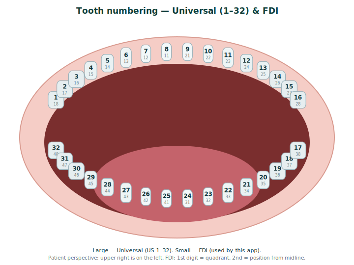

# Glossary & Tooth Numbering

A plain-language reference for people new to dentistry, so the app and docs make
sense. This is **educational only** - it does not diagnose, recommend treatment,
define clinical thresholds, produce a complete treatment plan, or authorize any
physical use. See [SAFETY.md](SAFETY.md).

## FDI tooth numbering

OpenSource Ortho identifies teeth using the **FDI (FDI World Dental Federation
notation) two-digit system** (also called the ISO 3950 system). The engine uses
FDI internally and rejects mixed numbering (see `orthoplan/model/identity.py`).

The first digit is the **quadrant**; the second is the **position** counting out
from the front midline.

**Permanent quadrants** (the perspective is the patient's own left/right):

| Digit | Quadrant |
|-------|----------|
| 1 | Upper right |
| 2 | Upper left |
| 3 | Lower left |
| 4 | Lower right |

**Position** (second digit), counting from the midline backward:

| Digit | Tooth | Type |
|-------|-------|------|
| 1 | Central incisor | incisor |
| 2 | Lateral incisor | incisor |
| 3 | Canine (cuspid) | canine |
| 4 | First premolar | premolar |
| 5 | Second premolar | premolar |
| 6 | First molar | molar |
| 7 | Second molar | molar |
| 8 | Third molar (wisdom tooth) | molar |

So **`11`** is the upper-right central incisor, **`23`** the upper-left canine,
**`46`** the lower-right first molar. Primary ("baby") teeth use quadrants
**5-8** (5 upper right, 6 upper left, 7 lower left, 8 lower right) with positions
1-5; the model accepts these too.

> The diagram shows the **Universal** number (US 1–32) large and the **FDI**
> number small. The app uses FDI internally; Universal is shown because it is the
> most common chart in the US. The mapping table below covers both.
>
> **Why are there two number types?** They come from different traditions and are
> both still in everyday use: **FDI** is the international standard (a quadrant
> digit + a position digit), while **Universal** is the long-standing US habit of
> counting every tooth 1–32 in a single loop. They label the **same teeth** —
> only the numbers differ.

### Numbering systems for orientation only

The engine is FDI-only. This table is just to help readers coming from other
charts; it is **not** used by the code.

| FDI | Tooth | Universal (US) | Palmer |
|-----|-------|----------------|--------|
| 11 | Upper right central incisor | 8 | 1┘ |
| 16 | Upper right first molar | 3 | 6┘ |
| 21 | Upper left central incisor | 9 | └1 |
| 26 | Upper left first molar | 14 | └6 |
| 31 | Lower left central incisor | 24 | ┌1 |
| 36 | Lower left first molar | 19 | ┌6 |
| 41 | Lower right central incisor | 25 | 1┐ |
| 46 | Lower right first molar | 30 | 6┐ |

## Key terms (A-Z)

- **Arch** - one jaw's row of teeth: **maxillary** (upper) or **mandibular**
  (lower). Derived from the FDI id, never stored separately (`model/identity.py`).
- **Attachment** - a small composite bump bonded to a tooth so an aligner can
  grip it and deliver a movement. Recorded as planning intent only
  (`model/clinical.py::Attachment`); it is not a force model.
- **Canine (cuspid)** - the pointed "corner" tooth (position 3).
- **Coordinate frame** - the named axis system movements are expressed in. The
  canonical `scan-local` frame has **z** = vertical (occlusogingival) and **x/y**
  spanning the horizontal occlusal plane (`model/geometry.py`).
- **Crowding** - too little space, so teeth overlap or twist. The educational
  demo simulates crowding correction.
- **Cumulative pose** - a tooth's total position after summing every stage's
  movement up to a point (`planning/transforms.py`).
- **Data gap** - a missing record (roots, CBCT, occlusion, etc.) that limits what
  the engine can assess (`model/gaps.py`). The app surfaces these instead of
  guessing.
- **Extrusion** - moving a tooth **out** of the bone (occlusally). Opposite of
  intrusion. Capped by `intrusion_extrusion_mm` (`model/settings.py::AxisCaps`).
- **FDI notation** - the two-digit tooth-numbering system above.
- **Finding** - a structured, controlled-vocabulary observation from a
  deterministic rule or a linted model advisory (`evaluation/finding.py`). Never
  an approval.
- **Fixed tooth** - a tooth intended to stay still for part or all of a plan
  (`model/clinical.py::FixedTooth`). The generator/optimizer will not move it.
- **Incisor** - a front cutting tooth (positions 1-2).
- **Intrusion** - pushing a tooth **into** the bone (apically). Capped by
  `intrusion_extrusion_mm`.
- **IPR (interproximal reduction)** - removing a sliver of enamel between two
  adjacent teeth to create space (`model/clinical.py::InterproximalReduction`,
  in millimeters between a tooth pair).
- **Malocclusion** - a "bad bite": teeth that do not meet/align as intended. The
  app does **not** diagnose malocclusion.
- **Mesh / STL** - the 3D surface model of a scan. STL files carry no units, so
  units start **unverified** until you confirm them (`model/assets.py`).
- **Molar** - a large back chewing tooth (positions 6-8).
- **Movement cap** - the maximum per-stage movement the engine treats as a review
  threshold: linear, vertical, angular (tip/torque), and rotation
  (`model/settings.py::AxisCaps`). User-configurable heuristics, not clearance.
- **Occlusion** - how upper and lower teeth meet when biting.
- **Premolar (bicuspid)** - a tooth between canine and molars (positions 4-5).
- **Provenance** - where data came from: patient-derived, imported, manual,
  model-generated, or synthetic (`model/assets.py::MeshProvenance`).
- **Quadrant** - one of the four mouth sections; the FDI first digit.
- **Rotation** - turning a tooth around its own long axis. Capped by
  `rotation_deg`.
- **Segmentation** - splitting a whole-arch scan into individual per-tooth
  meshes. Required before the engine can move or align teeth individually.
- **Spacing** - unwanted gaps between teeth (`model/clinical.py::PlannedSpacing`).
- **Stage** - one step of an aligner sequence; each stage holds per-tooth
  movement deltas (`model/plan.py::Stage`).
- **Tip** - mesiodistal **angulation** (tilting a tooth forward/backward along
  the arch). Capped by `angular_deg`.
- **Torque** - buccolingual **inclination** (tilting the crown in/out). Capped by
  `angular_deg`. Tip/torque are not rendered without a trusted per-tooth frame.
- **Translation (x/y/z)** - sliding a tooth in millimeters: x/y in the occlusal
  plane, z vertical.
- **Units** - the real-world scale of a scan (mm, cm, …). Must be confirmed
  before millimeter checks run (`scale_confirmed` in `model/plan.py`).
- **Wear interval** - how many days each aligner stage is worn; multiplies the
  stage count into a projected (not promised) duration (`planning/timeline.py`).
