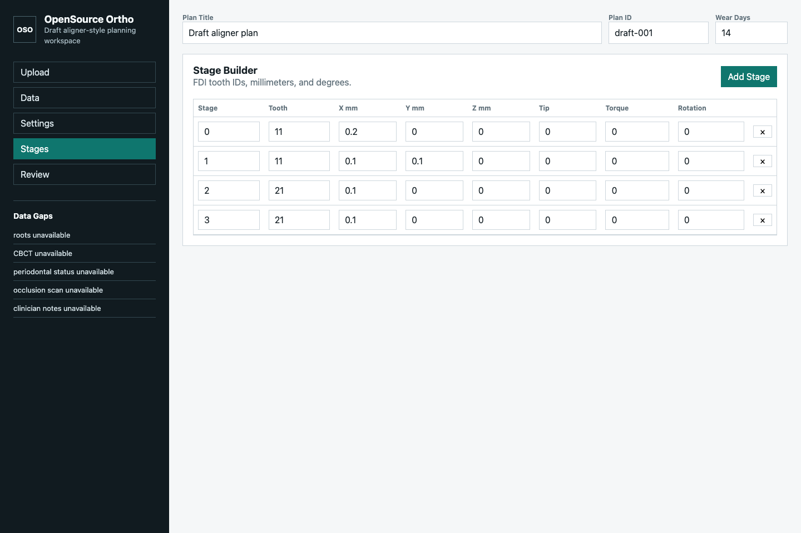
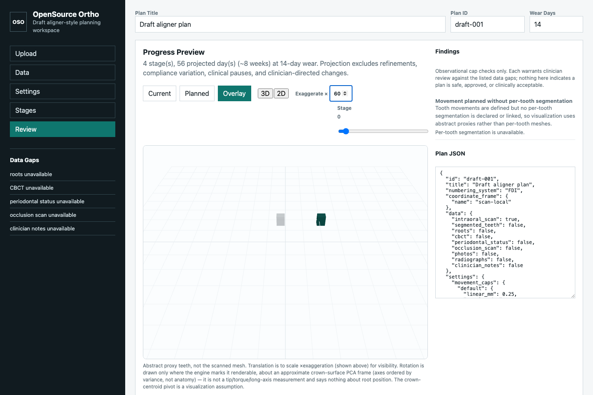

# Phase 2 UI Prototype




Browser prototype for the data-model workflow:

1. Guided educational STL review, synthetic 12-month crowding demo, and canonical OrthoCAD scan fixture
2. multi-file STL upload metadata with browser-side upload persistence
3. data availability toggles
4. movement cap controls
5. stage movement table
6. timeline projection
7. progress preview
8. scoped Plan AI chat
9. plan-shaped JSON output
10. print-export readiness and package metadata

## Run it

The UI is backed by the Python engine and must be served by the dev server so
it can reach `POST /api/evaluate`:

```bash
python3 -m orthoplan.server        # or: orthoplan serve
```

Then open `http://127.0.0.1:8000`.

The Upload step includes a short Getting Started panel for first-time users.

## Modes

The sidebar mode switch exposes two workflows:

- **Guided** is for non-technical educational review. It lets a user upload an STL
  or launch a synthetic crowding demo, acknowledges that the preview is not a
  diagnosis or treatment plan, and focuses the review surface on visualization and
  findings. The built-in demo uses synthetic tooth-shaped models with crown/cusp
  detail for clarity; it does not represent patient anatomy.
- **Clinician** is the advanced workspace for records, caps, staged movement,
  clinical controls, print metadata, optimized staging, and plan JSON.

## Plan AI

The Review panel includes a compact chat surface. It posts the current
plan-shaped JSON to `POST /api/chat` with a selected connector, model
preference, and context scope. The default `local` connector produces an
educational explanation without leaving the local server. External connectors
for OpenAI, Claude Code, MCP hosts, Odysseus, and open-source models are visible
in the UI but return a clear "not enabled" response until an explicit provider
gateway is configured.

The connector settings panel includes session-only API key entry and future
agent/MCP access controls. API keys are not written into plan JSON, case
snapshots, or exported reports.

Context scopes:

- **Summary**: findings, data gaps, timeline, and clinical controls.
- **Clinical metadata**: summary plus mesh/tooth-mesh metadata.
- **Full plan snapshot**: the complete plan payload.

## Engine is the single source of truth

The UI does **not** compute findings, data gaps, the timeline, or cumulative
tooth poses itself. On every edit it sends the plan-shaped JSON to
`POST /api/evaluate`, and renders exactly what `orthoplan.api.evaluate_plan`
returns - the same deterministic rules, lint-gated findings (with their data
gap and follow-up question), data-gap actions, timeline projection, and
acquisition advice, timeline projection, and `StageProgressFrame` data used
everywhere else. Cumulative movement in the canvas comes from the engine's
frames, and rotation is shown only as tabular values unless the engine receives
a trusted non-approximate anatomical frame.

If the engine is unreachable (e.g. the page was opened via `file://`), the UI
shows an "engine offline" message instead of silently falling back to a second,
divergent implementation.

Browser STL metadata is approximate; `orthoplan.io.stl_import.inspect_stl()`
remains the source of truth for mesh inspection. Uploaded STL files are stored
locally in IndexedDB so a small upper/lower scan set survives reloads on the
same browser; they are not uploaded to a server database.

## Canonical scan fixture

`ui/example-scans/canonical-orthocad-001/` contains upper and lower whole-arch
OrthoCAD shell STLs used to keep exact scan rendering stable as the product
evolves. The Guided and Clinician upload screens can load that pair as a 6-month
or 12-month educational progression. The scan layer is the actual STL geometry;
the movement sequence is simulated until segmented per-tooth meshes are available.

## 3D viewer

The Progress Preview renders in 3D via Three.js (`viewer3d.js`), with a 2D/3D
toggle (2D canvas is the fallback when WebGL is unavailable). Important honesty
constraints, surfaced in the on-screen caveat:

- It renders registered local STL tooth meshes when `render_meshes` links are
  available from the Python API. Otherwise it falls back to schematic proxy teeth.
  Plan JSON still does not store mesh bytes; local mesh serving is limited to
  `/api/mesh/<mesh_asset_id>` files registered in the local mesh workspace.
- Uploaded or canonical whole-arch STL scans render as an exact enamel-colored
  scan layer in Current and Overlay views. Current schematic proxy teeth are hidden
  when that exact scan layer is present, so the user is not shown two competing
  "current" anatomies.
- Whole-arch scans are rotated from common STL dental coordinates into the viewer
  frame (`x, y, z` -> `x, z, -y`) so the occlusal plane lies on the 3D grid and
  tooth height points upward.
- Translation is exact but **exaggerated** by the on-screen ×factor so sub-mm
  movement is visible next to ~10 mm teeth.
- Rotation is drawn **only** where the engine sets `rotation_renderable`. The
  approximate crown-surface PCA frame (`tooth_frames` in the API) is metadata
  only; by itself it does not authorize rendered rotation.

Three.js (r169, MIT) is **vendored** under `ui/vendor/` and loaded via an import
map, so the app runs fully offline with no runtime calls to any external host.
To update it, replace `ui/vendor/three.module.js` and `ui/vendor/OrbitControls.js`
with a matching pinned pair.

## Print Export

The Settings step has print-export fields for format, delivery email, dental model
material, thermoforming material, and acknowledgement. The Review step renders backend
readiness status from `print_export`. `orthoplan print-package` generates stage proxy STL
files, a hash-bound manifest, optional deterministic zip package, and optional email draft
from the supplied plan data.

## Tests

Pure, DOM-free UI logic lives in `core.js` (HTML escaping, contiguous stage
reindexing, frame pose extraction, the async stale-response token guard) so it
can be unit-tested under Node with no browser or jsdom:

```bash
cd ui && node --test        # or, from the repo root: node --test 'ui/*.test.js'
```

The DOM modules (`render.js`, `plan.js`) import these helpers from `core.js`
rather than defining them inline, so the tested code is the shipped code.

A headless-browser smoke/visual-regression test (`tests/e2e/test_viewer_smoke.py`)
verifies the 3D viewer mounts a sized WebGL canvas, the acquisition panel renders,
print export readiness is visible, 2D/3D screenshot artifacts are non-empty, the 2D
canvas has non-background movement pixels, and invalid stage input reaches both the
machine-readable API rejection state and visible engine rejection state. It is skipped
unless Playwright is installed:

```bash
pip install -e ".[e2e]" && python -m playwright install chromium
pytest tests/e2e -q
```

All three suites (Python, JS, e2e) run in CI on every push and pull request.

The screenshots above are generated headlessly (no patient data) and can be
regenerated after UI changes:

```bash
pip install -e ".[e2e]" && python -m playwright install chromium
python tools/capture_screenshots.py    # writes docs/images/*.png
```
