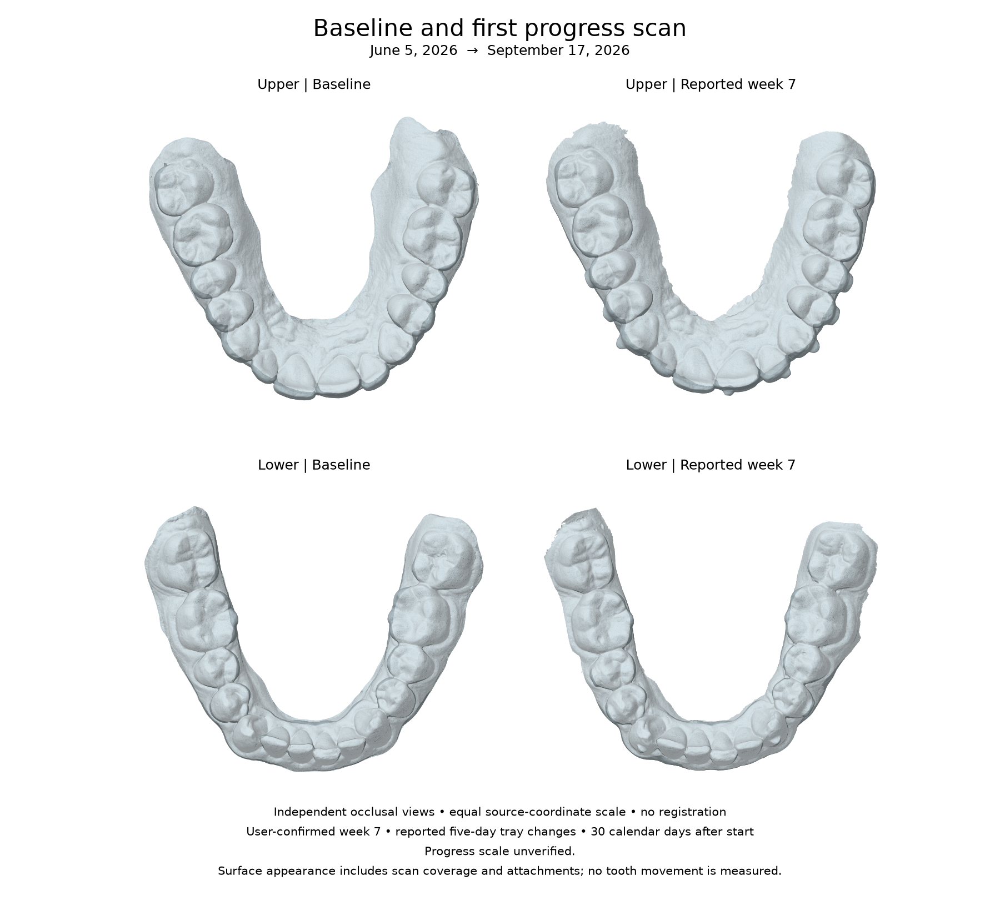
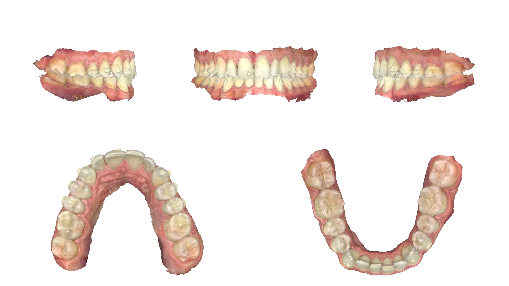

# Baseline to first progress scan

This is the first longitudinal update for specimen
`spec-07b7031938c84b1a9c98517b8bc4cdd3` (the existing User 1 sample).
The contributor confirms the new pair as **week 7**, explaining that trays were
being changed every **five days**. It is a progress record;
no final outcome or treatment-effectiveness assessment has been supplied.



The figure renders all triangles from the four actual STL files, with equal
source-coordinate scale, independent centering, and view-only rotations. It
does not align corresponding teeth or measure their displacement. The baseline
uses `shell_occlusion` exports; the update uses `shell_teethup`. The progress
pair's physical scale and shared bite frame remain unverified. Differences in
coverage, gingiva, attachments, and orientation can affect apparent changes.

## Timeline and provenance

| Record | Recorded date | Evidence |
| --- | --- | --- |
| Pretreatment upper/lower STL | 2026-06-05 | Previously confirmed by contributor |
| Same-person CBCT | 2026-06-18 | Previously confirmed; raw DICOM remains local |
| Treatment start | 2026-08-18 | Previously reported by contributor |
| Tray 5 report | Unknown | Historical report; not a current tray assertion |
| First progress upper/lower STL | 2026-09-17 | Source HTML explicitly labels scanning date |
| Progress export | 2026-09-21 | Source XML export date |

The scans are **104 days apart**. The recorded treatment start is **30 days
before the progress scan**. The contributor clarified that the **week 7** label
reflects progress with **five-day tray changes**, rather than seven elapsed
calendar weeks. The source dates remain unchanged. The date when the five-day
schedule began and the actual tray per arch were not supplied; neither export
time nor the XML treatment-stage code establishes a tray number.
The first progress sequence index is `1`, meaning the first contributed progress
visit, not tray 1 or week 1. Machine-readable events and missing fields are in
[longitudinal-record.json](longitudinal-record.json).

## File-level comparison

| Arch | Baseline triangles | Progress triangles | Change in triangle count |
| --- | ---: | ---: | ---: |
| Upper | 330,309 | 332,227 | +1,918 |
| Lower | 286,801 | 265,329 | -21,472 |

Triangle counts describe export tessellation and coverage, not tooth movement.
The progress upper mesh contains seven zero-area triangles; the lower contains
none. Source geometry is preserved without repairs, decimation, or rescaling.
The manifest records SHA-256 hashes, triangle-soup vertex counts, raw bounds,
arch labels, and the progress role. The new unit labels remain `unverified`
because STL does not declare a unit and independent scale confirmation is absent.

The reproducible [comparison JSON](progress-01-comparison.json) contains raw
geometry statistics and explicit null values for tooth movement and tracking
error. Millimeter bounds proxies are suppressed for unverified scan units.
No root/bone registration from the baseline engineering fixture is transferred
to the new scan pair.
The reviewed benchmark corpus remains limited to the two exact baseline asset
hashes; adding a progress visit does not confer benchmark-review status on it.

## Available context and source views

The previous **38-tray plan**, historical **tray 5** report, reported attachment
placement correspondence, partial unreviewed attachment transcription, and
reported absence of IPR as of 2026-06-18 remain in
[treatment-context.json](treatment-context.json). The new export supplies no
confirmed current tray, adherence, updated IPR, attachment
inventory, refinement history, or final result. Empty source fields are not
treated as evidence that an intervention did not occur.
The five-day wear interval comes from the contributor's follow-up clarification,
not the source export. It describes reported practice, not a recommended schedule.



Full-resolution source views: [front](progress-01-front.jpg),
[upper](progress-01-upper.jpg), [lower](progress-01-lower.jpg),
[left](progress-01-left.jpg), and [right](progress-01-right.jpg).
These are textured scanner renderings, not clinical photographs. View labels
follow the source export. There are no equivalent baseline color views in the
tracked case, so the baseline/progress figure uses STL geometry for both visits.

[Source metadata](progress-01-source-metadata.json) preserves export versions,
software version, procedure labels, declared scan ranges, transform arrays,
asset hashes, and an inventory of excluded source artifacts. Transform semantics
and object association are unverified; the arrays must not be reapplied to the
STLs or interpreted as cross-time registration.

The two STL files and six JPEGs are byte-for-byte copies with neutral file
labels. STL headers are blank. The images were inspected for visible identifiers;
JPEG metadata contains only standard JFIF information. Identifying XML, HTML,
PDF paperwork, the vendor logo, and the original archive are excluded. Exact
case dates follow this specimen's existing date-retention exception; neutral
labels do not make anatomical data anonymous.

## Reproduce and extend

Install the optional plotting dependencies in your environment:

```bash
python3 -m pip install numpy matplotlib
python3 tools/compare_canonical_progress.py
```

The generator checks input hashes against the manifest before rendering and
regenerates both comparison artifacts. The committed figure used NumPy 2.4.6
and Matplotlib 3.11.2. Rendering details are recorded in the comparison JSON.

For another update, keep the same specimen ID, add `progress-02-upper.stl` and
`progress-02-lower.stl`, and append scan entries and a new timeline event without
replacing older records. Record acquisition provenance, reported week, actual
tray per arch, scale verification, and any confirmed treatment changes. Add
source hashes and reviewed metadata; use null for unknown facts. Extend the
comparison generator explicitly when selecting another visit.

This case supports scan-processing research in a clear-aligner planning safety
playground and research toolkit. A single person's scan history does not
provide a treatment plan, appliance design, or evidence of safe physical use
for another person. Measuring tooth movement requires reviewed correspondence,
verified scale, and a justified registration method.
